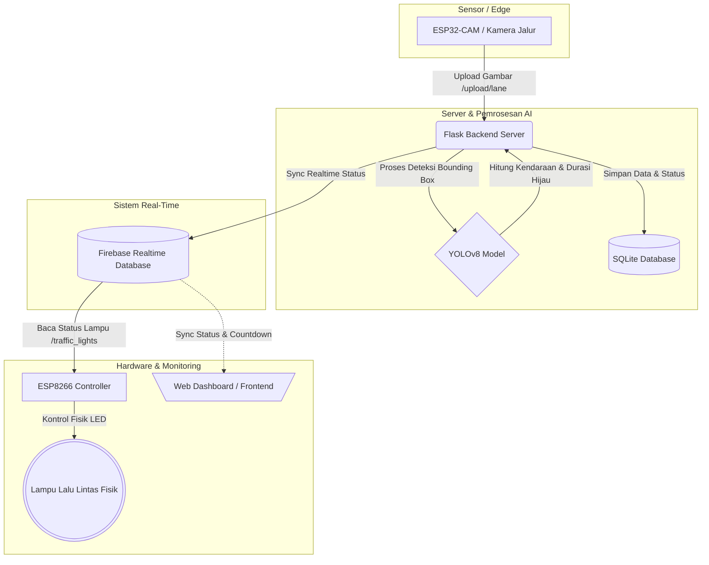

# Smart Traffic Light Monitoring System 🚦🤖

Sistem Pemantauan Lampu Lalu Lintas Cerdas (Adaptive Traffic Light) berbasis Internet of Things (IoT) dan Artificial Intelligence (AI). Proyek ini menggunakan **YOLOv8** untuk mendeteksi kepadatan kendaraan secara real-time dan mengatur durasi lampu hijau secara dinamis sesuai tingkat kemacetan jalan.

---

## 📌 Alur Kerja Sistem (System Architecture)



1. **Pengambilan Gambar (ESP32-CAM):** Kamera ditempatkan pada setiap jalur (Jalur A, B, C) untuk mengambil gambar jalan secara berkala (misalnya tiap 10 detik) dan mengirimkannya ke Flask Backend via HTTP POST.
2. **Deteksi Kendaraan (YOLOv8):** Backend Flask memproses gambar yang diterima menggunakan model YOLOv8 untuk menghitung jumlah kendaraan seperti `car` (mobil), `motorcycle` (motor), `bus` (bus), dan `truck` (truk).
3. **Logika Durasi Adaptif:** Berdasarkan total jumlah kendaraan, backend menghitung tingkat kepadatan (`SEPI`, `NORMAL`, `PADAT`) dan menyesuaikan durasi lampu hijau (`10s`, `20s`, `30s`, `40s`).
4. **Sinkronisasi Cloud (Firebase):** Data status lampu (`GREEN`, `YELLOW`, `RED`), sisa waktu (countdown), dan jumlah kendaraan disinkronkan secara real-time ke **Firebase Realtime Database**.
5. **Output Fisik (ESP8266):** Mikrokontroler ESP8266 secara real-time membaca status lampu dari Firebase dan mengatur nyala fisik lampu lalu lintas (LED Merah, Kuning, Hijau) pada persimpangan jalan.
6. **Pemantauan (Web Dashboard):** Pengguna dapat memonitor status lampu, countdown, tabel statistik kendaraan, serta melihat gambar langsung hasil deteksi YOLOv8.

---

## 🛠️ Teknologi & Modul Pendukung

### **Backend & AI**
* **Python (Flask):** Framework backend untuk API Upload dan Routing Server.
* **Ultralytics YOLOv8 (yolov8n.pt):** Model Computer Vision teringan untuk deteksi objek presisi tinggi.
* **OpenCV:** Digunakan untuk memanipulasi gambar dan menambahkan anotasi bounding box.
* **SQLite:** Basis data lokal untuk penyimpanan persisten status lalu lintas.
* **Firebase REST API / SDK:** Penghubung database real-time untuk sinkronisasi perangkat hardware dan frontend web.

### **IoT Hardware**
* **ESP32-CAM:** Mengambil gambar dan mengunggahnya ke server.
* **ESP8266 (NodeMCU):** Mengambil status dari Firebase dan menyalakan LED Lampu Lalu Lintas.
* **Lampu LED (Merah, Kuning, Hijau):** Sebagai representasi fisik lampu lalu lintas.

---

## 📁 Struktur Proyek

```text
smart_traffic/
├── app.py                      # File utama Flask Web Server & Routing API
├── config.py                   # Konfigurasi konstanta, jalur penyimpanan, & durasi adaptif
├── controller.py               # Logika antrian & pengaturan siklus lampu lalu lintas
├── database.py                 # Inisialisasi & Query database SQLite (traffic.db)
├── firebase.py                 # Skrip sinkronisasi data dari SQLite ke Firebase RTDB
├── yolo.py                     # Skrip pemrosesan gambar & deteksi objek dengan YOLOv8
├── requirements.txt            # Daftar pustaka / dependensi Python
├── .env.example                # Template konfigurasi variabel lingkungan (.env)
│
├── model/
│   └── yolov8n.pt              # Model YOLOv8 Nano pre-trained weights
├── templates/
│   └── dashboard.html          # Halaman antarmuka utama Dashboard Web
├── static/
│   ├── style.css               # Desain visual dashboard web (Dark & Light Mode)
│   ├── dashboard.js            # Logika sinkronisasi Firebase & Update UI Dashboard
│   ├── uploads/                # Folder penyimpanan gambar raw dari ESP32-CAM
│   └── yolo/                   # Folder hasil keluaran deteksi gambar YOLOv8
│
├── esp32_cam_upload/
│   └── esp32_cam_upload.ino    # Source code program Arduino untuk ESP32-CAM
└── esp8266_traffic_light/
    └── esp8266_traffic_light.ino # Source code program Arduino untuk ESP8266 & LED
```

---

## 🚀 Panduan Instalasi & Menjalankan Projek

### 1. Klon Repositori & Masuk ke Direktori
```bash
git clone https://github.com/cyator-zach/smart-traffic.git
cd smart_traffic
```

### 2. Konfigurasi Backend Python
* **Buat Virtual Environment (Opsional tetapi disarankan):**
  ```bash
  python -m venv venv
  # Aktifkan di Windows:
  venv\Scripts\activate
  # Aktifkan di macOS/Linux:
  source venv/bin/activate
  ```
* **Install Dependensi:**
  ```bash
  pip install -r requirements.txt
  ```

### 3. Setup Konfigurasi `.env`
Salin berkas `.env.example` menjadi `.env` lalu sesuaikan kredensial Firebase Anda:
```env
# URL Firebase REST API (berakhir dengan .firebaseio.com)
FIREBASE_BACKEND_URL=https://nama-projek-rtdb.firebaseio.com/

# Kredensial Firebase SDK untuk Frontend Web
FIREBASE_API_KEY=AIzaSy...
FIREBASE_AUTH_DOMAIN=nama-projek.firebaseapp.com
FIREBASE_PROJECT_ID=nama-projek
FIREBASE_STORAGE_BUCKET=nama-projek.appspot.com
FIREBASE_MESSAGING_SENDER_ID=1234567890
FIREBASE_APP_ID=1:123456:web:abcd
FIREBASE_DATABASE_URL=https://nama-projek-rtdb.firebaseio.com/
```

### 4. Jalankan Flask Backend Server
```bash
python app.py
```
Aplikasi akan otomatis menginisialisasi database `traffic.db`, mengunduh model YOLOv8 (bila belum ada), dan menjalankan server di `http://127.0.0.1:5000`.

---

## 🔌 Setup Perangkat Hardware (IoT)

### A. ESP32-CAM (Upload Gambar)
1. Buka file `esp32_cam_upload/esp32_cam_upload.ino` menggunakan Arduino IDE.
2. Atur konfigurasi SSID dan password Wi-Fi:
   ```cpp
   const char* ssid = "SSID_WIFI_ANDA";
   const char* password = "PASSWORD_WIFI_ANDA";
   ```
3. Sesuaikan alamat IP / domain server Anda pada variabel `server_host`.
4. Sesuaikan konstanta `JALUR` (`"a"`, `"b"`, atau `"c"`) sebelum melakukan flash ke masing-masing ESP32-CAM per jalur.
5. Upload kode ke papan ESP32-CAM.

### B. ESP8266 (Lampu Lalu Lintas)
1. Hubungkan Pin LED Lampu Lalu Lintas ke ESP8266 dengan skema pin default:
   * **Jalur A:** Merah (`D0`), Kuning (`D1`), Hijau (`D2`)
   * **Jalur B:** Merah (`D3`), Kuning (`D4`), Hijau (`D5`)
   * **Jalur C:** Merah (`D6`), Kuning (`D7`), Hijau (`D8`)
2. Buka `esp8266_traffic_light/esp8266_traffic_light.ino` di Arduino IDE.
3. Install pustaka `Firebase ESP Client` melalui Library Manager.
4. Masukkan konfigurasi Wi-Fi serta host Firebase & API Key Anda:
   ```cpp
   #define WIFI_SSID "SSID_WIFI_ANDA"
   #define WIFI_PASSWORD "PASSWORD_WIFI_ANDA"
   #define FIREBASE_HOST "nama-projek-rtdb.firebaseio.com"
   #define FIREBASE_API_KEY "API_KEY_FIREBASE_ANDA"
   ```
5. Upload kode ke papan ESP8266.

---

## 📈 Logika Penentuan Durasi Lampu Hijau

Sistem ini menentukan durasi lampu hijau di `config.py` secara otomatis berdasarkan jumlah kendaraan terdeteksi:

| Jumlah Kendaraan Terdeteksi | Tingkat Kepadatan | Durasi Lampu Hijau |
|-----------------------------|-------------------|--------------------|
| 0 - 5 Kendaraan             | **SEPI**          | 10 Detik           |
| 6 - 15 Kendaraan            | **NORMAL**        | 20 Detik           |
| 16 - 30 Kendaraan           | **PADAT**         | 30 Detik           |
| > 30 Kendaraan              | **SANGAT PADAT**  | 40 Detik           |

*Lampu Kuning transisi diatur tetap selama **3 detik** sebelum berpindah jalur.*
